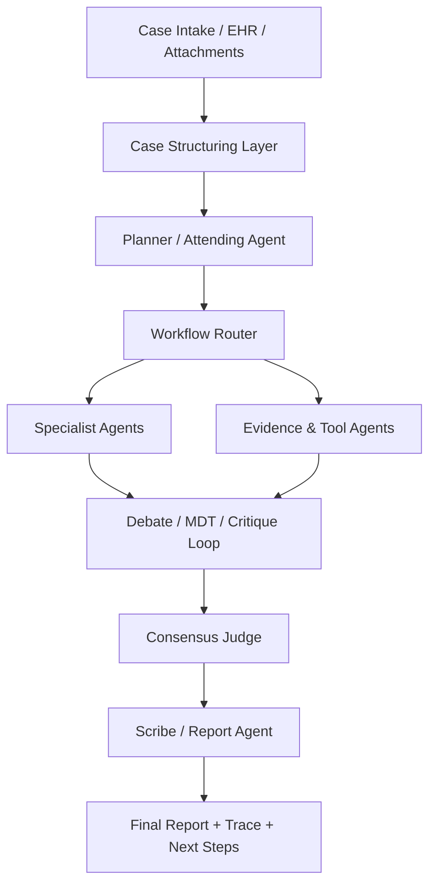

# Rare Disease Multi-Agent Framework Design

## 1. 背景与目标

本项目的目标不是简单地让多个大模型“同时回答一个病例”，而是构建一个面向罕见病诊断与治疗规划的、可追溯、可配置、可扩展的多智能体协作框架。

对于罕见病场景，真正的难点通常不在单次问答，而在以下几个方面：

- 病例信息不完整，且往往跨多个器官系统。
- 症状与常见病重叠，容易出现过早收敛和误诊。
- 诊断路径依赖多轮检查、会诊、复核和证据更新。
- 遗传、影像、实验室、病理、文献等证据类型高度异构。
- 输出不应只有一个“答案”，而应包含鉴别诊断、支持证据、冲突证据、下一步检查建议和升级会诊条件。

因此，本项目建议采用 `Role × Skill × Workflow` 的框架设计：

- `Role`：定义 agent 在系统中的职责。
- `Skill`：定义 agent 可以调用的能力、工具和知识接口。
- `Workflow`：定义多个 agent 如何协作、何时分歧、何时收敛。

该设计的目标是让系统同时支持：

- 罕见病鉴别诊断
- MDT 会诊式协作
- Debate / Critique / Referee 等多种讨论范式
- 基于规则、基于图、基于 DAG 的工作流编排
- 高度可客制化的角色配置与技能组合

## 2. 设计原则

### 2.1 Planner 不直接等于诊断器

`Planner` 应负责统筹病例拆解、工作流选择、证据缺口管理和 specialist 选择，而不是把所有诊断任务都自己做完。

### 2.2 角色与技能解耦

同一个角色可以挂载不同技能，同一个技能也可以被多个角色复用。
例如 `Neurology Specialist` 可以在 `MDT` 工作流中发言，也可以在 `Debate` 工作流中作为某个假设的支持方。

### 2.3 Workflow 不应 hardcode 在 prompt 中

系统应该支持将工作流表达为图结构或配置结构，而不是把全部逻辑写死在单个 prompt 模板中。

### 2.4 证据优先于结论

每个关键判断都应绑定来源证据。
输出应优先呈现：

- 当前假设是什么
- 证据支持什么
- 哪些证据冲突
- 下一步做什么检查最有信息增益

### 2.5 不确定性必须显式管理

对罕见病系统而言，`abstain`、`insufficient evidence`、`need escalation` 不是失败，而是系统应该主动输出的合法状态。

### 2.6 Specialist 应动态选择，而非全量常驻

每个病例不需要让全部 specialist 一起发言。
推荐由 planner 根据器官系统、风险等级、证据类型和 workflow 选择 3-5 个核心 specialist，再视需要追加 critic 或 reviewer。

## 3. 总体架构



### 3.1 分层建议

建议将系统拆成六层：

- `Case Structuring Layer`
  - 负责 intake parsing、HPO/标准化表型抽取、时间线重建、家族史提取、既往检查摘要。
- `Planning Layer`
  - 负责病例拆解、分诊、workflow 选择、specialist 选取、终止条件定义。
- `Expert Reasoning Layer`
  - 由各类 specialist agent、challenger、critic 等角色组成。
- `Evidence & Tool Layer`
  - 负责 RAG、文献检索、遗传工具、知识图谱、药物知识、影像摘要等工具调用。
- `Consensus Layer`
  - 负责 vote、judge、referee、disagreement logging。
- `Reporting Layer`
  - 负责结构化结果、临床摘要、下一步建议、审计轨迹。

## 4. 推荐角色设计

## 4.1 控制与编排类角色

### 4.1.1 Planner / Attending Physician

职责：

- 读取病例，判断当前任务是诊断、治疗规划还是急危重症分诊。
- 选择 workflow，如 `MDT`、`Debate`、`Triage -> Consult`、`Investigate -> Update`。
- 选择本轮 specialist 和 tool agents。
- 明确本轮 objective、stop condition、需要关闭的 evidence gaps。
- 维护 case state 和 hypothesis state。

它是整个系统的“大脑”，但不应承担全部临床推理工作。

### 4.1.2 Orchestrator

职责：

- 负责多 agent 执行顺序、回合控制、超时与预算控制。
- 按 workflow 将不同 agent 的输出拼接到同一个讨论上下文中。
- 管理并发、重试、回退策略。

如果 `Planner` 偏临床推理，`Orchestrator` 更偏系统调度。

### 4.1.3 Consensus Judge / Referee

职责：

- 比较多个 agent 的最终意见。
- 处理冲突、重复、低质量论证。
- 对结果做排序、置信度聚合和分歧保留。
- 决定是否达到“可输出状态”或“需要升级会诊状态”。

### 4.1.4 Scribe / Report Agent

职责：

- 将过程转化为临床可读报告和前端可消费结构。
- 统一输出格式，避免多 agent 原始文本风格不一致。
- 生成 trace、decision summary、evidence summary、recommended next steps。

## 4.2 临床推理类角色

### 4.2.1 Phenotype Structurer

职责：

- 从 EHR 和自由文本中提取症状、体征、家族史、年龄、性别、病程、阴性表现。
- 进行 HPO 映射和 phenotype normalization。
- 形成结构化病例视图，供 planner 和 specialist 复用。

### 4.2.2 Differential Challenger

职责：

- 专门攻击当前主假设。
- 提出 mimic、常见病解释、证据冲突、被忽略的替代诊断。
- 防止系统过早收敛。

这个角色建议长期保留，即使 workflow 是 MDT，也应至少有一个挑战者。

### 4.2.3 Test Planner

职责：

- 根据当前 evidence gaps，选择下一步最有信息增益的检查、复核或会诊。
- 输出推荐检查及其目的，而不是只给“建议进一步完善检查”这种泛化表述。

### 4.2.4 Treatment / Care Pathway Agent

职责：

- 在诊断候选相对稳定后，负责治疗思路、药物风险、急性期处理、随访路径和转诊建议。
- 支持 `Surgical / Treatment Plan` 场景。

### 4.2.5 Safety Critic

职责：

- 检查红旗征、危险建议、证据不足但结论过强、遗漏的 ICU / Emergency 风险。
- 对输出进行医疗安全层面的兜底审核。

## 4.3 专科类角色

专科 agent 应来自一个动态 specialist pool，而不是写死全部参与者。

结合当前项目，第一阶段建议保留以下基础池：

- `Pediatrics Specialist`
- `Neurology Specialist`
- `Pulmonary Specialist`
- `ICU Specialist`
- `Emergency Specialist`
- `Orthopedics / Bone Specialist`
- `Medical Genetics Specialist`
- `Cross-specialty MDT Specialist`

后续可扩展：

- `Metabolic Specialist`
- `Hematology Specialist`
- `Immunology Specialist`
- `Nephrology Specialist`
- `Cardiology Specialist`
- `Endocrinology Specialist`
- `Pathology Specialist`
- `Pharmacology Specialist`

## 4.4 证据与工具类角色

### 4.4.1 Knowledge Retriever

职责：

- 统一进行 rare disease 知识检索与证据卡片构造。
- 优先检索权威结构化资源，再回退到文献和网页搜索。

建议优先纳入的数据源：

- Orphanet
- GeneReviews
- OMIM
- HPO
- Mondo
- PubMed / guideline references

### 4.4.2 Genomics Agent

职责：

- 处理遗传模式、候选基因、变异解释、表型-基因一致性。
- 整合 ClinVar、ClinGen、gnomAD、LIRICAL、Exomiser 等结果。

### 4.4.3 Multimodal Evidence Agent

职责：

- 处理影像、实验室、病理、药物史等非纯文本证据。
- 将多模态证据抽象成可被 specialist 理解的结构化 findings。

### 4.4.4 Guideline / SOP Retriever

职责：

- 根据病例和 workflow，检索本地 SOP、指南、共识、路径建议。
- 为 planner 生成 branch constraints 和 checklists。

## 5. 推荐技能体系

技能建议按能力域划分，而不是按角色划分。

## 5.1 Shared Skills

适用于大多数角色：

- `structured_case_reading`
- `evidence_binding`
- `confidence_calibration`
- `uncertainty_reporting`
- `conflict_explicitization`
- `clinical_report_writing`
- `abstain_and_escalate`

## 5.2 Phenotype Skills

- `hpo_mapping`
- `negation_detection`
- `timeline_extraction`
- `family_history_parsing`
- `organ_system_clustering`
- `phenopacket_export`

## 5.3 Rare Knowledge Skills

- `orphanet_retrieval`
- `gene_reviews_retrieval`
- `omim_retrieval`
- `mondo_alignment`
- `pubmed_guideline_search`
- `evidence_card_generation`

## 5.4 Genomics Skills

- `inheritance_reasoning`
- `gene_phenotype_matching`
- `variant_triage`
- `clinvar_interpretation`
- `exomiser_lirical_interpretation`

## 5.5 Multimodal Skills

- `lab_abnormality_summarization`
- `imaging_finding_abstraction`
- `pathology_pattern_summary`
- `medication_history_summary`

## 5.6 Protocol Skills

- `mdt_discussion`
- `debate_protocol`
- `critique_and_revise`
- `vote_and_rank`
- `consensus_judging`
- `counterfactual_review`

## 5.7 Governance Skills

- `audit_trace_generation`
- `cost_budget_control`
- `latency_budget_control`
- `tool_call_policy`
- `human_review_gate`

## 6. 角色与技能绑定建议

| Role | Recommended Skills |
| --- | --- |
| Planner / Attending Physician | structured_case_reading, workflow_routing, uncertainty_reporting, evidence_gap_tracking |
| Orchestrator | cost_budget_control, latency_budget_control, tool_call_policy, workflow_execution |
| Phenotype Structurer | hpo_mapping, timeline_extraction, family_history_parsing, organ_system_clustering |
| Knowledge Retriever | orphanet_retrieval, gene_reviews_retrieval, omim_retrieval, pubmed_guideline_search, evidence_card_generation |
| Genomics Agent | inheritance_reasoning, gene_phenotype_matching, variant_triage, clinvar_interpretation |
| Multimodal Evidence Agent | lab_abnormality_summarization, imaging_finding_abstraction, pathology_pattern_summary |
| Specialist Agents | structured_case_reading, evidence_binding, specialty_reasoning, critique_and_revise |
| Differential Challenger | counterfactual_review, conflict_explicitization, uncertainty_reporting |
| Test Planner | evidence_gap_tracking, next_best_test_planning, checklist_generation |
| Treatment / Care Pathway Agent | medication_reasoning, ddi_checking, follow_up_planning, care_pathway_design |
| Safety Critic | safety_review, red_flag_detection, escalation_checking |
| Consensus Judge | vote_and_rank, consensus_judging, disagreement_logging |
| Scribe / Report Agent | clinical_report_writing, audit_trace_generation, structured_export |

## 7. 推荐工作流设计

## 7.1 Workflow 应该是配置，不是固定 prompt

建议每个 workflow node 至少包含以下属性：

- `role`
- `skills`
- `input_schema`
- `output_schema`
- `entry_condition`
- `exit_condition`
- `next_nodes`

这样系统可以灵活表达不同协作模式。

## 7.2 基础工作流

### 7.2.1 Basic Diagnostic Flow

适用于多数常规病例：

1. Phenotype Structurer
2. Planner
3. Knowledge Retriever
4. Selected Specialists
5. Differential Challenger
6. Consensus Judge
7. Scribe

### 7.2.2 MDT Flow

适用于多器官受累、跨学科病例：

1. Planner 选择 3-5 个 specialist
2. 各 specialist 独立初判
3. 多轮讨论
4. Safety Critic 和 Differential Challenger 插入
5. Consensus Judge 聚合
6. Scribe 输出 MDT report

### 7.2.3 Debate Flow

适用于相似病鉴别、分歧明显的病例：

1. Planner 生成 top-k hypotheses
2. 为每个核心 hypothesis 指定 champion
3. Differential Challenger 或其他 specialist 负责反驳
4. 多轮 rebuttal
5. Referee / Judge 做裁决和保留意见

### 7.2.4 Investigate -> Update Loop

适用于信息缺失明显的病例：

1. Planner 识别 evidence gaps
2. Test Planner 生成下一步检查
3. 系统等待新信息
4. 更新 case state
5. 重新排序 hypotheses

这是罕见病最重要的 workflow 之一，因为很多病例无法在单轮完成。

### 7.2.5 Genotype-first Flow

适用于已经有 panel / exome / trio / variant 信息的病例：

1. Genomics Agent 主导
2. Phenotype Structurer 补 phenotype constraints
3. Knowledge Retriever 补 gene-disease evidence
4. Specialist review
5. Judge 输出 ranked molecular explanation

### 7.2.6 Treatment Planning Flow

适用于诊断候选相对稳定后的治疗场景：

1. Planner 确认进入 treatment mode
2. Treatment Agent 生成方案草案
3. Pharmacology / Safety Critic 审核风险
4. Specialist review
5. Judge 生成 treatment recommendation + caution list

## 8. 数据结构建议

为了支持可追溯与前后端解耦，建议将多 agent 过程统一输出为结构化对象。

## 8.1 CaseProfile

```json
{
  "demographics": {},
  "chief_complaint": "",
  "timeline": [],
  "phenotypes": [],
  "negative_findings": [],
  "family_history": [],
  "labs": [],
  "imaging": [],
  "pathology": [],
  "genetics": [],
  "attachments": []
}
```

## 8.2 EvidenceCard

```json
{
  "id": "",
  "source_type": "guideline|literature|tool|ehr|memory",
  "source_name": "",
  "claim": "",
  "support_level": "high|medium|low",
  "quoted_span": "",
  "structured_fields": {},
  "url": ""
}
```

## 8.3 Hypothesis

```json
{
  "id": "",
  "label": "",
  "category": "rare|common_mimic|cross_specialty",
  "confidence": 0.0,
  "supporting_evidence_ids": [],
  "conflicting_evidence_ids": [],
  "next_tests": [],
  "status": "active|downgraded|ruled_out|needs_more_data"
}
```

## 8.4 DiscussionTurn

```json
{
  "round": 1,
  "agent": "",
  "role": "",
  "stance": "support|oppose|neutral",
  "summary": "",
  "evidence_ids": [],
  "open_questions": []
}
```

## 8.5 ConsensusState

```json
{
  "workflow": "mdt|debate|triage|treatment",
  "rounds_completed": 0,
  "agreement_score": 0.0,
  "active_disagreements": [],
  "escalation_required": false
}
```

## 8.6 FinalReport

```json
{
  "ranked_hypotheses": [],
  "top_diagnosis": null,
  "why_this_not_that": [],
  "recommended_tests": [],
  "safety_flags": [],
  "care_plan": [],
  "trace": [],
  "consensus_state": {}
}
```

## 9. 与当前项目的映射建议

当前仓库已经存在以下角色：

- `Orchestrator`
- `Planner`
- `Generator`
- `Fact Checker`
- `Guideline Retriever`
- `Web Search`

建议的演进路线如下：

| Current Role | Recommended Future Positioning |
| --- | --- |
| Planner | 保留为核心总调度角色，强化 workflow routing 和 evidence gap management |
| Orchestrator | 偏系统控制层，负责回合、预算、并发和流程推进 |
| Generator | 逐步收敛为 Scribe / Report Agent，避免承担过多诊断职责 |
| Fact Checker | 演进为 Safety Critic + Differential Challenger 的组合或拆分 |
| Guideline Retriever | 扩展为 Knowledge Retriever / SOP Retriever |
| Web Search | 作为 retriever 的 fallback 能力，不建议单独承担核心临床判断 |

建议下一阶段新增的最重要角色：

1. `Phenotype Structurer`
2. `Knowledge Retriever`
3. `Differential Challenger`
4. `Consensus Judge`
5. `Scribe / Report Agent`

中期再增加：

1. `Genomics Agent`
2. `Multimodal Evidence Agent`
3. `Test Planner`
4. `Treatment / Care Pathway Agent`

## 10. 实施路线建议

## 10.1 Phase 1: 先把“骨架”搭起来

目标：

- 明确 role registry
- 明确 skill registry
- 明确 workflow schema
- 明确结构化输出 schema

这一阶段不追求所有 agent 都很强，先保证架构稳定。

## 10.2 Phase 2: 强化 planner 和 retriever

目标：

- planner 能根据病例自动选 workflow
- retriever 能统一构造 evidence cards
- specialist 输出不再直接依赖自由文本上下文，而是依赖结构化病例与证据卡片

## 10.3 Phase 3: 上线真正的 MDT / Debate

目标：

- 支持独立初判
- 支持多轮讨论
- 支持 challenger 和 judge
- 支持 disagreement logging

## 10.4 Phase 4: 引入 genetics 和 multimodal

目标：

- 将 rare disease 的核心优势做出来
- 支持表型-基因联合推理
- 支持影像 / 实验室 / 变异解释

## 10.5 Phase 5: 做高可配置工作流平台

目标：

- 前端可配置 role、skill、workflow
- 同一个病例支持切换 `MDT`、`Debate`、`Investigate -> Update`
- 支持按医院场景加载本地 SOP 与 specialist pool

## 11. 风险与注意事项

- 不应让每个 agent 都具备 unrestricted web search 能力，否则证据口径会失控。
- 不应让 specialist 既负责“提出方案”又负责“最终裁决”，否则难以形成真正的对抗与审查。
- 罕见病诊断需要保留“未决状态”，不要强制输出唯一诊断。
- 附件如果只传文件名，agent 对多模态证据的理解将非常有限，后续需要升级为真正的文件解析或结构化摘要。
- Workflow 越丰富，越需要统一的 trace schema 和 replay 能力，否则调试会很困难。

## 12. 结论

本项目建议采用以 `Planner` 为中心、以 `Role × Skill × Workflow` 为核心抽象的多智能体框架：

- 用 `Role` 表达职责边界
- 用 `Skill` 表达工具能力与知识接口
- 用 `Workflow` 表达协作模式

在这个设计下，系统可以同时支持：

- rare disease 诊断
- MDT 会诊
- debate / critique / referee
- 动态 specialist 选择
- genetics / multimodal / guideline / memory 等能力的逐步扩展

这会比“固定几个 agent 轮流发言”的方案更稳、更可追溯，也更适合后续产品化。

## 13. 参考资料

- RareAgents: Advancing Rare Disease Care through LLM-Empowered Multi-disciplinary Team
  https://openreview.net/pdf/ca1c21e6cbbbca1ebabec95b184d1a8f2b7af95a.pdf
- Enhancing diagnostic capability with multi-agents conversational large language models
  https://www.nature.com/articles/s41746-025-01550-0
- KG4Diagnosis: A Hierarchical Multi-Agent LLM Framework with Knowledge Graph Enhancement for Medical Diagnosis
  https://arxiv.org/abs/2412.16833
- MEDDxAgent
  https://aclanthology.org/2025.acl-long.677.pdf
- A Layered Debating Multi-Agent System for Similar Disease Diagnosis
  https://aclanthology.org/anthology-files/pdf/naacl/2025.naacl-short.46.pdf
- An Agentic System for Rare Disease Diagnosis with Traceable Reasoning
  https://arxiv.org/abs/2506.20430
- RareCollab -- An Agentic System Diagnosing Mendelian Disorders with Integrated Phenotypic and Molecular Evidence
  https://arxiv.org/abs/2602.04058
- Orphanet
  https://www.orpha.net/
- Mondo Disease Ontology
  https://mondo.monarchinitiative.org/
- GeneReviews
  https://www.ncbi.nlm.nih.gov/books/NBK1116/
- ClinVar
  https://www.ncbi.nlm.nih.gov/clinvar/
